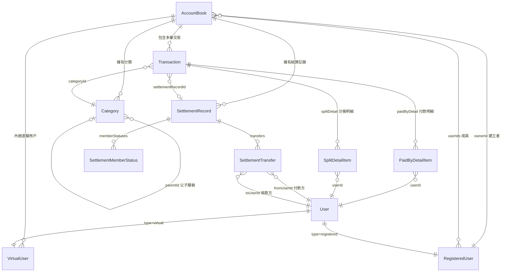
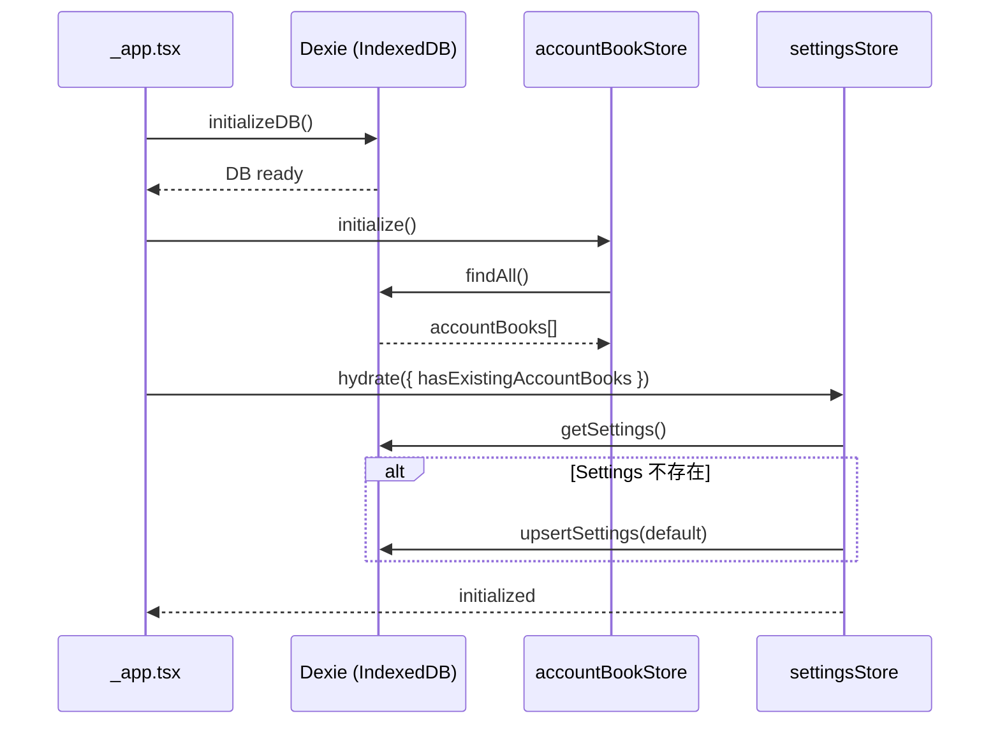
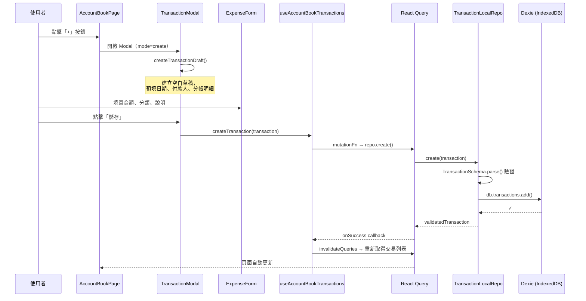

# Duoji — 開發者 Onboarding 指南

> **Duoji** 是一個多人共用記帳應用程式，支援帳本管理、收支記錄、分帳結算、報表分析等功能。
> 本文件幫助新加入的開發者快速理解專案架構、領域模型、以及各層之間的關係。

---

## 目錄

1. [專案架構介紹](#1-專案架構介紹)
2. [Clean Architecture 三層架構](#2-clean-architecture-三層架構)
3. [Entity 定義](#3-entity-定義)
4. [Entity 關係圖](#4-entity-關係圖)
5. [Repository 與 Use Case 對照表](#5-repository-與-use-case-對照表)
6. [應用程式初始化流程](#6-應用程式初始化流程)
7. [資料流範例 — 新增一筆支出](#7-資料流範例--新增一筆支出)
8. [頁面路由對照](#8-頁面路由對照)
9. [領域概念補充](#9-領域概念補充)

---

## 1. 專案架構介紹

### Monorepo 結構

本專案使用 **Nx monorepo**，以 **pnpm** 管理依賴：

```
duoji/
├── apps/
│   ├── web/              # Next.js 前端應用（核心）
│   ├── backend/          # NestJS 後端（scaffold，尚未實作業務邏輯）
│   ├── web-e2e/          # Playwright E2E 測試
│   └── backend-e2e/      # 後端 E2E 測試
├── openspec/             # Spectra Spec-Driven Development 規格文件
│   ├── specs/            # 規格定義
│   └── changes/          # 變更提案
├── docs/                 # 說明文件
├── package.json          # Root package（Nx scripts）
├── nx.json               # Nx 設定
└── pnpm-workspace.yaml   # pnpm workspace 設定
```

### 技術棧

| 層級          | 技術                                                |
| ------------- | --------------------------------------------------- |
| 前端框架      | Next.js 15 + React 19                               |
| UI 元件庫     | HeroUI + TailwindCSS                                |
| 狀態管理      | Zustand（全域 Store）+ React Query（資料查詢 Hook） |
| Schema 驗證   | Zod v4                                              |
| 本地儲存      | IndexedDB via Dexie.js                              |
| 國際化        | next-intl（en-US / zh-TW）                          |
| 測試          | Jest（單元）+ Playwright（E2E）                     |
| Monorepo 工具 | Nx 20 + pnpm                                        |
| 後端框架      | NestJS 10（尚未實作業務邏輯）                       |

### 常用開發指令

```bash
pnpm dev:web       # 啟動前端開發伺服器
pnpm dev:backend   # 啟動後端開發伺服器
pnpm dev           # 同時啟動前端與後端
pnpm test:web      # 執行前端單元測試
pnpm build:web     # 建置前端 production bundle
npx nx e2e web-e2e # 執行 E2E 測試
```

---

## 2. Clean Architecture 三層架構

本專案遵循 Clean Architecture，**依賴方向由外向內收斂**，Entity 位於核心：

```
外層              中間層              核心層
┌──────────┐    ┌─────────────┐    ┌──────────┐
│ UI       │    │             │    │          │
│ (Pages,  │ →  │  Use Cases  │ →  │  Entity  │
│  Comps)  │    │  (Hooks,    │    │          │
├──────────┤    │   Stores)   │    │          │
│ Repo     │ →  │             │ →  │          │
│ (Local   │    │             │    │          │
│  Repo)   │    │             │    │          │
└──────────┘    └─────────────┘    └──────────┘

依賴方向：→（外層依賴內層，內層不依賴外層）
```

> **重點：UI 和 Repo 位於同一外層**，兩者都依賴 Use Cases 與 Entity，但彼此不直接依賴。

### 各層職責（由內到外）

| Layer                   | 目錄                             | 職責                                                                   |
| ----------------------- | -------------------------------- | ---------------------------------------------------------------------- |
| **Entity（核心層）**    | `src/entities/`                  | 純資料結構 + Zod Schema + 領域邏輯 + Repo Interface 定義。無外部依賴。 |
| **Use Cases（中間層）** | `src/hooks/` + `src/stores/`     | 協調 Repo 呼叫、管理衍生狀態、暴露資料與操作給 UI 層。                 |
| **Repository（外層）**  | `src/repositories/`              | 實作 Entity 中定義的 Repo Interface。目前使用 Dexie（IndexedDB）。     |
| **UI（外層）**          | `src/pages/` + `src/components/` | 頁面渲染、使用者互動。僅透過 Hooks / Stores 存取資料。                 |

### Dependency Inversion（依賴反轉）

本專案的一個重要設計是：**Repo Interface 定義在 Entity 層，實作在 Repo 層**。

```
Entity 層定義介面          Repo 層實作介面
┌─────────────────┐       ┌──────────────────────┐
│ transaction.ts  │       │ transactionLocalRepo  │
│                 │       │                      │
│ interface       │◄──────│ class                │
│ TransactionRepo │       │ TransactionLocalRepo │
│ { ... }         │       │ implements           │
│                 │       │ TransactionRepo      │
└─────────────────┘       └──────────────────────┘
```

這樣的設計讓核心層（Entity）不依賴具體的儲存實作。未來如果要換成 REST API 或其他 backend，只需新增一個 Repo 實作類別（如 `TransactionApiRepo`），不需要修改 Entity 或 Use Case 層的任何程式碼。

### Store vs Hook 的選擇原則

| 使用情境                       | 選擇                               | 範例                                                              |
| ------------------------------ | ---------------------------------- | ----------------------------------------------------------------- |
| 跨頁面/跨元件的全域共享狀態    | **Zustand Store**                  | `accountBookStore`, `userStore`, `categoryStore`, `settingsStore` |
| 單一頁面或元件子樹內的局部狀態 | **React Hook**（搭配 React Query） | `useAccountBookTransactions`, `useSettlement`                     |

---

## 3. Entity 定義

本專案有 **6 個核心 Entity**：

### AccountBook（帳本）

> 檔案：`src/entities/accountBook.ts`

多人共用的記帳單位。每個帳本有自己的幣別、成員列表、以及虛擬用戶。

| 欄位                      | 型別                      | 說明                          |
| ------------------------- | ------------------------- | ----------------------------- |
| `id`                      | `string`                  | 唯一識別碼                    |
| `name`                    | `string`                  | 帳本名稱                      |
| `currency`                | `'USD' \| 'JPY' \| 'TWD'` | 幣別                          |
| `description`             | `string`                  | 說明                          |
| `ownerId`                 | `string`                  | 建立者（RegisteredUser）的 ID |
| `userIds`                 | `string[]`                | 已註冊用戶的 ID 列表          |
| `virtualUsers`            | `VirtualUser[]`           | 虛擬用戶列表（內嵌於帳本中）  |
| `createdAt` / `updatedAt` | `number`                  | 時間戳記                      |

---

### Transaction（交易記錄）

> 檔案：`src/entities/transaction.ts`

一筆支出或收入記錄。核心欄位包含金額、日期、分類、付款人明細、以及分帳明細。

| 欄位                 | 型別                    | 說明                                      |
| -------------------- | ----------------------- | ----------------------------------------- |
| `id`                 | `string`                | 唯一識別碼                                |
| `type`               | `'expense' \| 'income'` | 交易類型                                  |
| `amount`             | `number`                | 總金額（正數）                            |
| `accountBookId`      | `string`                | 所屬帳本                                  |
| `categoryId`         | `string`                | 分類 ID                                   |
| `date`               | `string`                | 日期（`YYYY/MM/DD` 格式）                 |
| `description`        | `string`                | 說明                                      |
| `paymentMethod`      | `PaymentMethod`         | 付款方式                                  |
| `receivedByUserId`   | `string \| null`        | 收入的接收者（僅 income 有值）            |
| `tags`               | `string[]`              | 標籤                                      |
| `paidByDetail`       | `PaidByDetailItem[]`    | 誰付了多少（付款人明細）                  |
| `splitDetail`        | `SplitDetailItem[]`     | 誰應分擔多少（分帳明細）                  |
| `settlementRecordId` | `string`                | 對應的結算記錄 ID（預設 `__unsettled__`） |
| `deletedAt`          | `number \| null`        | 軟刪除時間戳記                            |

**PaidByDetailItem / SplitDetailItem** 結構：

```typescript
{ userId: string, userType: 'registered' | 'virtual', amount: number }
```

**業務規則（Zod `superRefine`）**：

- `income` 類型必須有 `receivedByUserId`
- `expense` 類型的 `receivedByUserId` 必須為 `null`

---

### User（使用者）

> 檔案：`src/entities/user.ts`

使用 Zod **Discriminated Union** 區分兩種使用者類型：

| 類型               | Schema               | 說明                                                                          |
| ------------------ | -------------------- | ----------------------------------------------------------------------------- |
| **RegisteredUser** | `type: 'registered'` | 已註冊的真實使用者，有 `email` 和 `avatarUrl`                                 |
| **VirtualUser**    | `type: 'virtual'`    | 帳本內建的虛擬成員，繫結 `accountBookId`，可標記為 `isSharedWallet`（公積金） |

兩者合併成 `User` 型別。提供輔助函式：

- `isDeletedUser(user)` — 檢查是否已被軟刪除
- `isSharedWalletUser(user)` — 檢查是否為公積金用戶

---

### Category（分類）

> 檔案：`src/entities/category.ts`

交易的分類，支援父子層級結構。每個 Category 繫結於特定 AccountBook。

| 欄位            | 型別                    | 說明                         |
| --------------- | ----------------------- | ---------------------------- |
| `id`            | `string`                | 唯一識別碼                   |
| `name`          | `string`                | 分類名稱                     |
| `imageUrl`      | `string`                | 圖示 URL                     |
| `type`          | `'expense' \| 'income'` | 適用的交易類型               |
| `parentId`      | `string \| null`        | 父分類 ID（`null` 表示頂層） |
| `accountBookId` | `string`                | 所屬帳本                     |
| `sortOrder`     | `number`                | 排序順序                     |

---

### SettlementRecord（結算記錄）

> 檔案：`src/entities/settlement.ts`

一次分帳結算的完整記錄，包含每位成員的應收/應付狀態，以及需要執行的轉帳列表。

| 欄位             | 型別                       | 說明                                                     |
| ---------------- | -------------------------- | -------------------------------------------------------- |
| `id`             | `string`                   | 唯一識別碼                                               |
| `accountBookId`  | `string`                   | 所屬帳本                                                 |
| `memberStatuses` | `SettlementMemberStatus[]` | 每位成員的結算狀態（paidAmount, splitAmount, netAmount） |
| `transfers`      | `SettlementTransfer[]`     | 建議轉帳清單                                             |

**SettlementMemberStatus**：

- `paidAmount`：該成員的代墊總額
- `splitAmount`：該成員的應分擔總額
- `netAmount`：淨額（正值=應收，負值=應付）

**SettlementTransfer**：

- `fromUserId` → `toUserId`，含 `suggestedAmount`、`actualAmount`、`status`（pending / completed）

---

### Settings（應用程式設定）

> 檔案：`src/entities/settings.ts`

應用程式層級的設定，全域唯一（`id` 固定為 `'app'`）。

| 欄位                  | 型別                 | 說明               |
| --------------------- | -------------------- | ------------------ |
| `id`                  | `'app'`              | 固定值             |
| `language`            | `'en-US' \| 'zh-TW'` | 介面語言           |
| `onboardingCompleted` | `boolean`            | 是否已完成新手引導 |

---

## 4. Entity 關係圖



### 關係摘要

- **AccountBook** 是頂層聚合根，包含 Transaction、Category、VirtualUser、SettlementRecord
- **Transaction** 透過 `paidByDetail` 和 `splitDetail` 與 User 產生多對多關係
- **Transaction** 透過 `settlementRecordId` 與 SettlementRecord 產生可選的一對一關係（未結算時為 `__unsettled__`）
- **User** 是 Discriminated Union，RegisteredUser 存在獨立 table，VirtualUser 內嵌於 AccountBook 的 `virtualUsers` 陣列
- **Category** 透過 `parentId` 支援自我引用的父子層級結構

---

## 5. Repository 與 Use Case 對照表

| Entity           | Repo Interface    | Local 實作             | 對應 Use Case                | 類型             |
| ---------------- | ----------------- | ---------------------- | ---------------------------- | ---------------- |
| AccountBook      | `AccountBookRepo` | `AccountBookLocalRepo` | `accountBookStore`           | Zustand Store    |
| Transaction      | `TransactionRepo` | `TransactionLocalRepo` | `useAccountBookTransactions` | React Query Hook |
| User             | `UserRepo`        | `UserLocalRepo`        | `userStore`                  | Zustand Store    |
| Category         | `CategoryRepo`    | `CategoryLocalRepo`    | `categoryStore`              | Zustand Store    |
| SettlementRecord | `SettlementRepo`  | `SettlementLocalRepo`  | `useSettlement`              | React Hook       |
| Settings         | `SettingsRepo`    | `SettingsLocalRepo`    | `settingsStore`              | Zustand Store    |

### 額外的 Hook

| Hook                              | 檔案                                       | 說明                   |
| --------------------------------- | ------------------------------------------ | ---------------------- |
| `useReportTransactions`           | `hooks/useReportTransactions.ts`           | 報表頁面的交易查詢     |
| `useUnsettledTransactions`        | `hooks/useUnsettledTransactions.ts`        | 查詢未結算的交易       |
| `useSettlementRecordTransactions` | `hooks/useSettlementRecordTransactions.ts` | 查詢特定結算記錄的交易 |
| `useExportTransactionsCsv`        | `hooks/useExportTransactionsCsv.ts`        | CSV 匯出功能           |
| `useAccountBookTagSuggestions`    | `hooks/useAccountBookTagSuggestions.ts`    | 帳本標籤自動建議       |

---

## 6. 應用程式初始化流程

應用程式啟動時，`_app.tsx` 依照以下順序初始化：



---

## 7. 資料流範例 — 新增一筆支出

以下以「使用者在帳本頁面新增一筆支出」為例，追蹤資料在各層之間的流動：



### 各層的職責在這個流程中的體現

| 層                     | 做了什麼                                                                                                    |
| ---------------------- | ----------------------------------------------------------------------------------------------------------- |
| **UI（Modal / Form）** | 管理表單草稿狀態（`draft`），呼叫 `createTransactionDraft()` 建立初始值，收集使用者輸入                     |
| **Use Case（Hook）**   | 透過 React Query 的 `useMutation` 包裝 Repo 的 `create` 方法，成功後觸發 `invalidateQueries` 讓列表自動更新 |
| **Repository**         | 使用 Zod Schema 驗證資料完整性，寫入 IndexedDB                                                              |
| **Entity**             | 定義 `TransactionSchema`（含 `superRefine` 業務規則驗證）和 `TransactionRepo` interface                     |

---

## 8. 頁面路由對照

### 路由結構

```
pages/
├── index.tsx                              # 首頁（自動導向第一個帳本或新手引導）
├── login.tsx                              # 登入頁
├── settings.tsx                           # 應用程式設定（語言、主題、重置資料）
├── onboarding/
│   └── index.tsx                          # 新手引導流程
└── account-books/
    ├── new.tsx                            # 建立新帳本
    └── [id]/
        ├── index.tsx                      # 帳本主頁（日曆 + 交易列表）
        ├── report.tsx                     # 報表分析頁
        ├── settings.tsx                   # 帳本設定
        └── settlement/
            ├── index.tsx                  # 結算總覽（未結算 + 歷史記錄）
            └── [recordId].tsx             # 結算記錄詳情
```

### 頁面功能說明

| 路由                                        | 功能                                                     | 使用的主要 Store / Hook                          |
| ------------------------------------------- | -------------------------------------------------------- | ------------------------------------------------ |
| `/`                                         | 路由守衛：有帳本 → 導向帳本頁，無帳本 → 新手引導         | `accountBookStore`, `settingsStore`              |
| `/onboarding`                               | 多步驟引導流程（建立帳本、新增成員、第一筆交易）         | `accountBookStore`, `userStore`, `categoryStore` |
| `/settings`                                 | 語言切換、深色模式、資料重置                             | `settingsStore`                                  |
| `/account-books/new`                        | 建立新帳本表單                                           | `accountBookStore`                               |
| `/account-books/[id]`                       | **核心頁面**：月曆視圖 + 當日交易列表 + TransactionModal | `useAccountBookTransactions`, `accountBookStore` |
| `/account-books/[id]/report`                | 報表：依分類/時間/成員/標籤篩選的收支分析                | `useReportTransactions`, `useCategoryStore`      |
| `/account-books/[id]/settings`              | 帳本設定：成員管理、分類管理                             | `accountBookStore`, `userStore`, `categoryStore` |
| `/account-books/[id]/settlement`            | 分帳結算：顯示未結算交易的 balance 與建議轉帳            | `useSettlement`, `useUnsettledTransactions`      |
| `/account-books/[id]/settlement/[recordId]` | 結算記錄詳情：逐筆標記轉帳完成                           | `useSettlementRecordTransactions`                |

---

## 9. 領域概念補充

### VirtualUser vs RegisteredUser

|          | RegisteredUser       | VirtualUser                         |
| -------- | -------------------- | ----------------------------------- |
| 來源     | 真實用戶註冊         | 帳本內建立                          |
| 儲存位置 | 獨立的 `users` table | 內嵌於 `AccountBook.virtualUsers[]` |
| 範圍     | 可跨帳本共用         | 僅屬於單一帳本（`accountBookId`）   |
| 用途     | 主要使用者           | 代表未註冊的旅伴、家人等            |

### SharedWallet（公積金）

SharedWallet 是一種特殊的 VirtualUser（`isSharedWallet: true`）。代表團體的共同基金，用於以下場景：

- 某些支出由公積金支付，需要在結算時按比例分攤給所有成員
- 結算計算時，公積金付的金額會從成員的 `splitAmount` 中扣除等比例的部分
- `computeSharedWalletSummary()` 會計算公積金的總支出、每人平均、以及個人借用金額

### Settlement（結算）流程

1. 收集帳本中所有 `settlementRecordId === '__unsettled__'` 的 expense
2. 透過 `computeMemberStatuses()` 計算每位成員的淨額
3. 透過 `computeMinimumTransfers()` 使用貪婪演算法產生最少轉帳次數的建議
4. 建立 `SettlementRecord`，同時將相關 Transaction 的 `settlementRecordId` 更新為該記錄 ID
5. 每筆 Transfer 可個別標記為 `completed`

### Soft Delete（軟刪除）

Transaction 使用 `deletedAt` 欄位實現軟刪除：

- 刪除時設定 `deletedAt = Date.now()`，資料仍保留在 IndexedDB
- 所有查詢方法（`findAll`, `findByDate` 等）會自動過濾 `deletedAt !== null` 的記錄
- 這保證了已結算的交易不會因為刪除而影響歷史結算記錄的完整性

### PaidByDetail / SplitDetail

每筆 Transaction 透過兩組明細記錄分帳資訊：

- **PaidByDetail**：記錄「誰付了多少」— 一筆支出可能由多人合付
- **SplitDetail**：記錄「誰應分擔多少」— 費用如何在成員間分攤

這兩組明細的 `amount` 總和都等於 Transaction 的 `amount`。結算時，系統透過計算 `paidAmount - splitAmount` 得出每人的淨額（正值=應收，負值=應付）。
